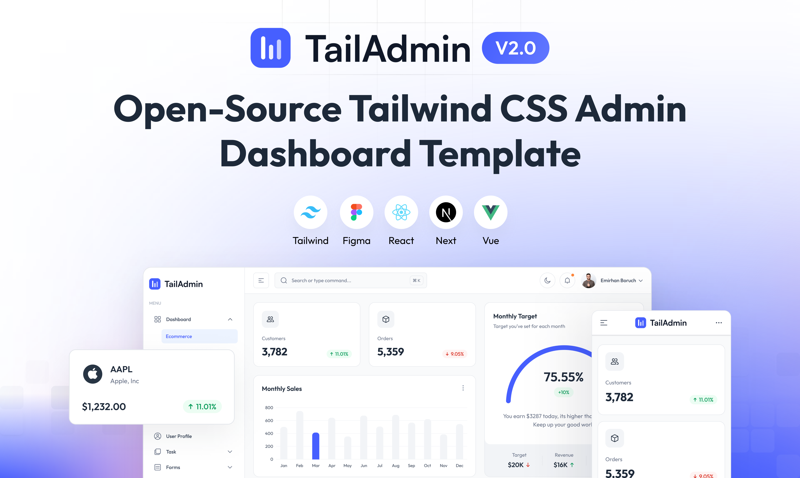

# Faunatic Next.js - Animal & Livestock Management Dashboard

Faunatic is a comprehensive admin dashboard template built on **Next.js and Tailwind CSS**, specifically designed for **animal and livestock management, transactions, and customer tracking**. It provides a feature-rich solution for managing animal inventory, financial transactions, and customer relationships.



Faunatic utilizes the power of **Next.js 16** (App Router), **React 19**, **Tailwind CSS v4**, and **Supabase** to deliver a robust and scalable application.

## Core Features

### 🐾 Animal Inventory Management
- **Inventory Tracking**: Manage animals with statuses like `ready` (available) and `sold`.
- **Profit Analysis**: Automatically track profit for each animal based on buy and sell prices.
- **Sourcing System**: Handle "Sourcing" states for animals sold before they are in inventory.

### 💰 Transaction System
The project implements a complete financial transaction workflow:
1. **Deposit**: Increase user balance.
2. **Tarik Tunai (Withdrawal)**: Decrease user balance.
3. **Beli Hewan (Buy Animal)**: Purchase animals for inventory (automatically creates animal records).
4. **Jual_hewan (Sell Animal)**: Sell animals from inventory or record a sourcing request.

### 👥 Customer & User Management
- Track customer transactions and balances.
- Manage user profiles and roles.

## Tech Stack

- **Framework**: [Next.js 16.x](https://nextjs.org/) (App Router)
- **Library**: [React 19](https://react.dev/)
- **Styling**: [Tailwind CSS v4](https://tailwindcss.com/)
- **Backend-as-a-Service**: [Supabase](https://supabase.com/)
- **Data Visualization**: [ApexCharts](https://apexcharts.com/)
- **Icons**: [Lucide React](https://lucide.dev/)

## Overview

Faunatic provides essential UI components and layouts for building feature-rich, data-driven admin dashboards.

### Quick Links

* [✨ Visit Website](https://Faunatic.com)
* [📄 Documentation](https://Faunatic.com/docs)
* [⬇️ Download](https://Faunatic.com/download)
* [🖌️ Figma Design File (Community Edition)](https://www.figma.com/community/file/1463141366275764364)
* [⚡ Get PRO Version](https://Faunatic.com/pricing)

## Installation

### Prerequisites

To get started with Faunatic, ensure you have the following prerequisites installed:

* Node.js 18.x or later (recommended to use Node.js 20.x or later)

### Setup

1. Clone the repository:
   ```bash
   git clone https://github.com/Faunatic/free-nextjs-admin-dashboard.git
   ```

2. Install dependencies:
   ```bash
   npm install
   ```

3. Configure Environment Variables:
   Create a `.env` file in the root directory and add your Supabase credentials and admin settings:
   ```env
   NEXT_PUBLIC_SUPABASE_URL=your_supabase_url
   SUPABASE_SERVICE_ROLE_KEY=your_service_role_key
   ADMIN_USERNAME=admin
   ADMIN_PASSWORD=your_password
   ```

4. Start the development server:
   ```bash
   npm run dev
   ```

## Components

The template includes:
* Sophisticated and accessible sidebar
* Data visualization components (Line and Bar charts)
* Animal management and transaction forms
* Profile management and custom 404 page
* Tables for inventory and transaction history
* Authentication flows (Sign-in/Sign-up)
* Dark Mode support 🕶️

## License

Faunatic Next.js Free Version is released under the MIT License.

## Support
If you find this project helpful, please consider giving it a star on GitHub. Your support helps us continue developing and maintaining this template.
